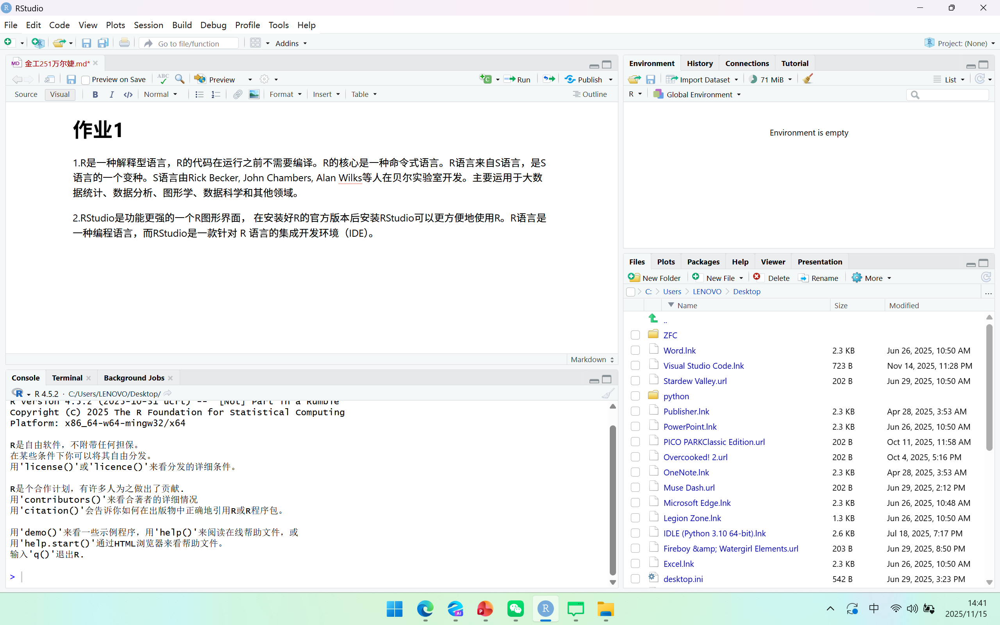
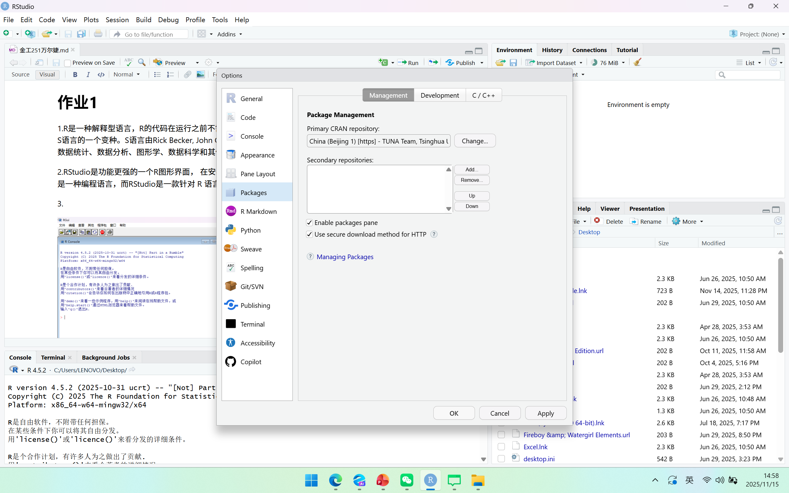
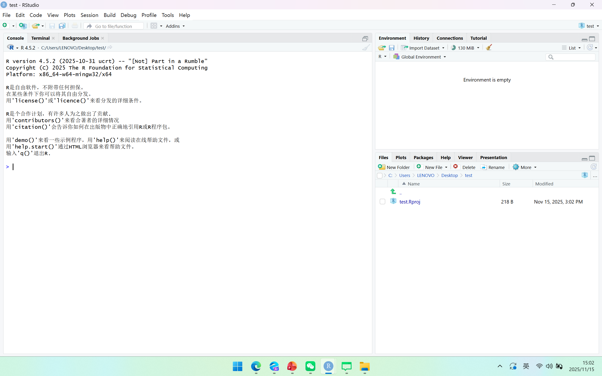
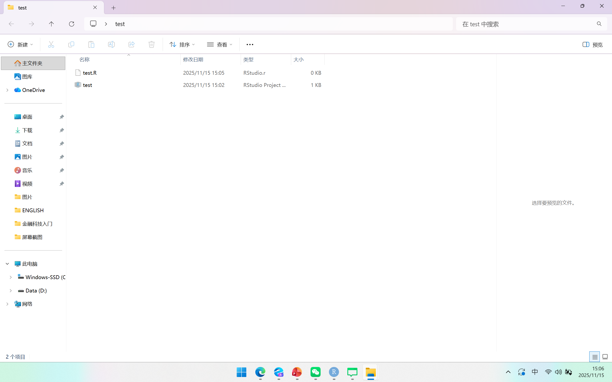
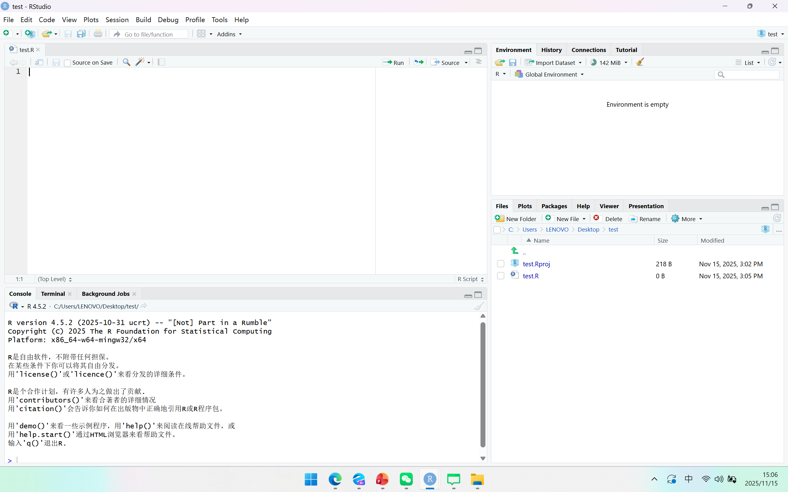

## 作业1

1.R是一种解释型语言，R的代码在运行之前不需要编译。R的核心是一种命令式语言。R语言来自S语言，是S语言的一个变种。S语言由Rick Becker, John Chambers, Alan Wilks等人在贝尔实验室开发。主要运用于大数据统计、数据分析、图形学、数据科学和其他领域。

2.RStudio软件是R软件的应用界面与增强系统， 可以在其中编辑、运行R的程序文件， 可以跟踪运行， 还可以构造文字、R结果图表融合在一起的研究报告、论文、图书、网站等。R语言是一种编程语言，而RStudio是一款针对 R 语言的集成开发环境（IDE）。

3.

4\.

5\.

6\.

