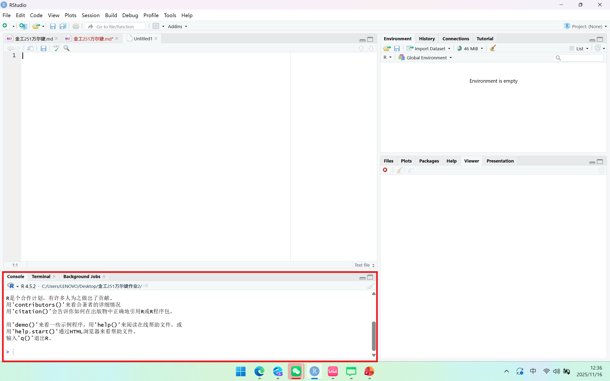
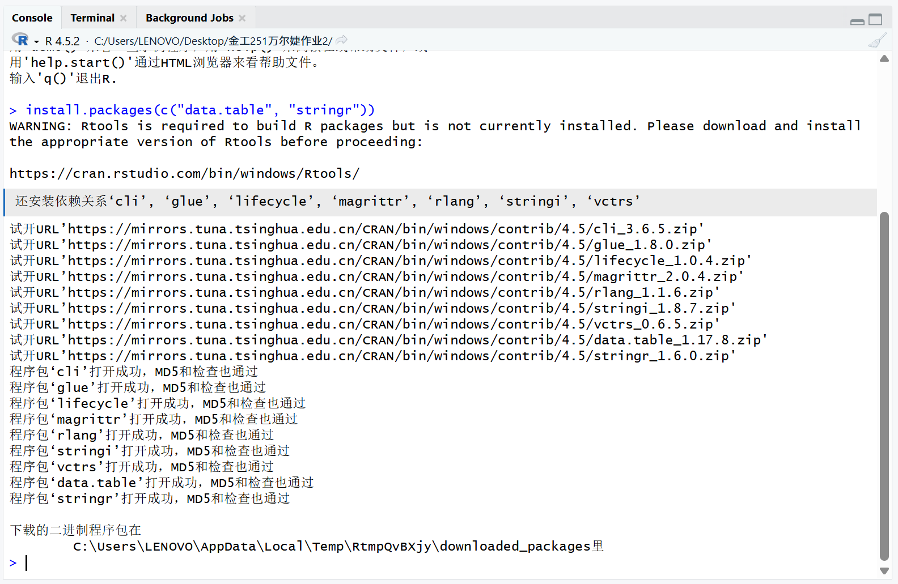
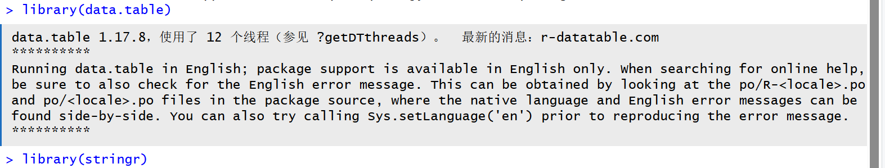
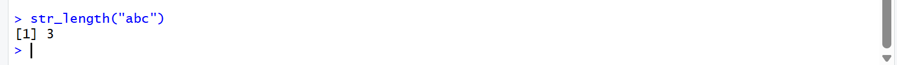
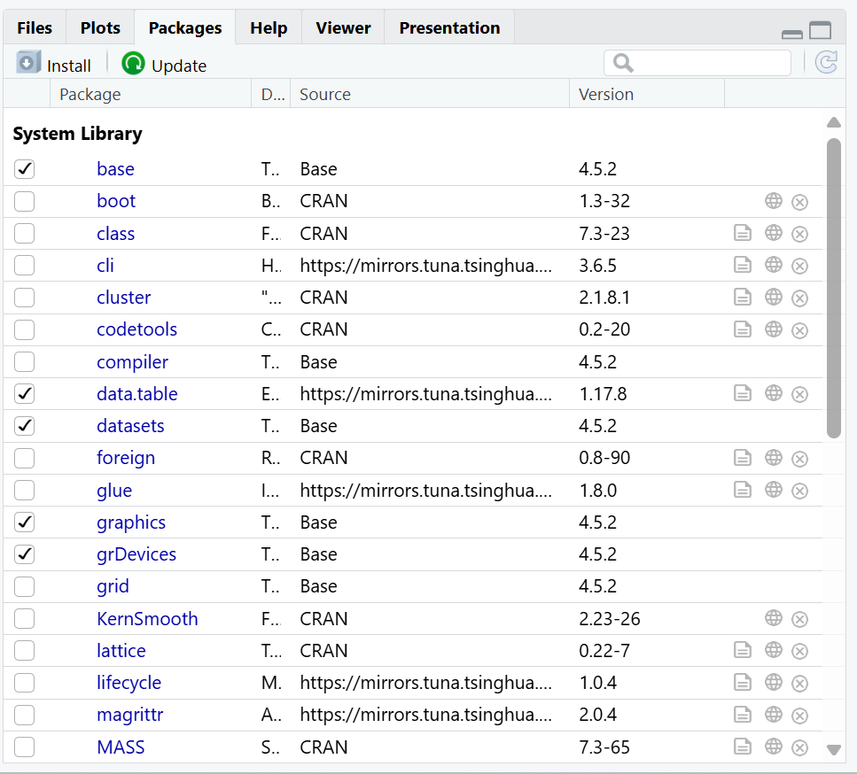
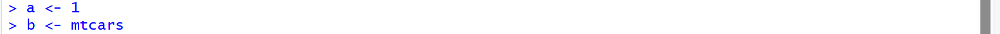
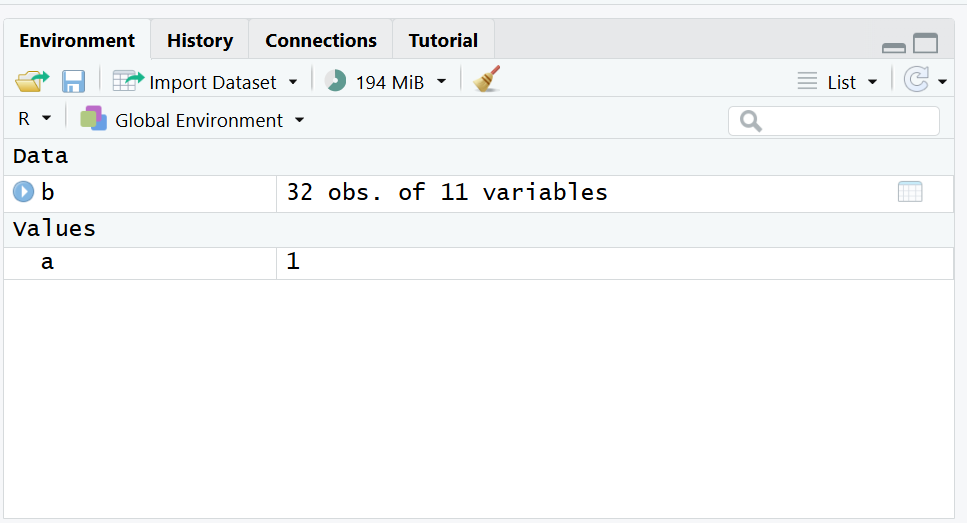

## 作业2

1.一行代码：

光标定位在该行任意位置，点击工具栏中的Run按钮。

快捷键Ctrl + Enter

多行代码：

鼠标选中多行代码，点击工具栏中的Run按钮。

快捷键Ctrl + Enter

2.控制台

3.使用 install.packages() 函数

4.使用 library() 函数

Packages面板

5.包经过安装之后，下次再打开相关的test.rproj文件不需要重新安装。每一次导入包之后，下次再打 开相关的test.rproj文件还需要再次导入。

6.\<-和=，Alt + “-”

7.Environment面板

8.使用#

快捷键Windows/Linux：Ctrl + Shift + C 或 macOS：Cmd + Shift + C
